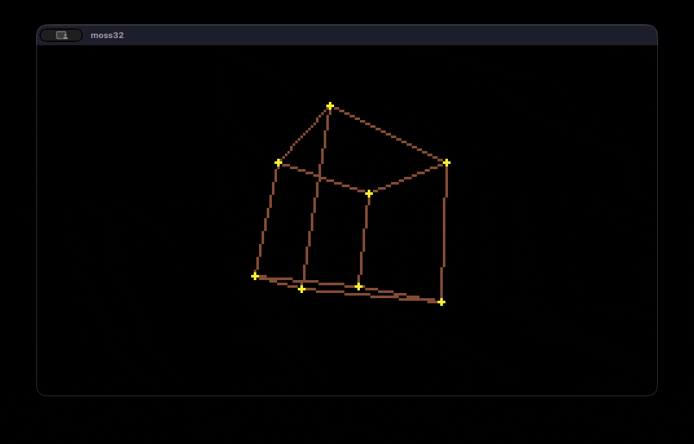

# moss

Retro Fantasy Console with a fixed 240x136 resolution and 32 color palette.

Thanks to [`@catnipped`](https://bsky.app/profile/ossianboren.bsky.social) for the **moss** name, the great included **Enias** font and which color palette to use! ([DawnBringer 32 Palette](https://lospec.com/palette-list/dawnbringer-32))

## Install

- download the moss executable from [releases](https://github.com/moss-32/moss/releases).

- download swamp cli from [swamp/swamp](https://github.com/swamp/swamp/releases).

- create your project directory

- initialize with the demo project

```sh
moss --init
```

the demo project should look like this:

```sh
packages/moss/lib.sw
swamp.yini
main.sw
```

## Usage

Compile with:

```sh
swamp build
```

build places the .moss file at `out/main.moss`

then you can run it with:

```sh
moss
```

(`out/main.moss` is default)

...and you should see:



## API

### wait_vsync()

```rust
fn wait_vsync()
```

Waits for the vertical retrace. Usually happens 60 times per second.

### set - Set pixel

```rust
set(x: Int, y: Int, palette_index: Int)
```

### clear - clear the screen

```rust
fn clear(palette_index: Int)
```

### gamepad - read the gamepad

```javascript
struct Gamepad {
    up: Bool,
    down: Bool,
    left: Bool,
    right: Bool,
    a: Bool,
    b: Bool,
    menu: Bool,
}

fn gamepad(player: Int) -> Gamepad
```

```rust
fn get(x: Int, y: Int) -> Int
```

```rust
fn sprite(x: Int, y: Int, width: Int, colors: [U8])
```

```rust
fn box(x: Int, y: Int, width: Int, height: Int, palette_index: Int)
```

```rust
fn line(x0: Int, y0: Int, x1: Int, y1: Int, palette_index: Int)
```

```rust
fn sprite_flip(x: Int, y: Int, width: Int, colors: [U8], flip_h: Bool, flip_v: Bool)
```

```rust
fn circle(x: Int, y: Int, radius: Int, palette_index: Int)
```

```rust
fn circle_fill(x: Int, y: Int, radius: Int, palette_index: Int)
```

```rust
fn char(x: Int, y: Int, ch: U8, palette_index: Int)
```

```rust
fn text(x: Int, y: Int, text: String, palette_index: Int)
```


## Examples

### Plasma

```rust
use moss::*

mut frame = 0

while true {

    wait_vsync()

    for y in 0..HEIGHT {
        for x in 0..WIDTH {
            v1 := (x + frame) / 11
            v2 := (y + frame*2) / 13
            v3 := (x + y + frame) / 17
            v4 := (x - y + frame*3) / 19

            palette_index := (v1 + v2 + v3 + v4) % 32

            set(x, y, palette_index)
        }
    }

    frame += 1
}
```

### Starfield

```rust
use moss::*

const CENTER_X = WIDTH/2
const CENTER_Y = HEIGHT/2
const FLY_SPEED = 3

mut frame = 0

while true {

    wait_vsync()

    clear(0)

    for i in 0..128 {
        star_x := (i * 39 % 160) - 80
        star_y := (i * 13 % 100) - 50

        z := (i * 11 - frame * FLY_SPEED) % 400

        scale := 400 - z

        screen_x := CENTER_X + (star_x * scale / 400)
        screen_y := CENTER_Y + (star_y * scale / 400)

        brightness := 10 + (scale / 11)

        if brightness > 1  {
            palette_index := if brightness >= 32 {
                31
            } else {
                brightness
            }
            set(screen_x, screen_y, palette_index)
        }
    }

    frame += 1
}
```

_Copyright (c) 2026 Peter Bjorklund. All rights reserved._
